<p align="center">
  
</p>

# CenTraL

_**Cen**tromeric **Tra**nscript capturing and **L**ong read sequencing._

**Status:** v1.0 alpha — in active use, API may change before the paper is published.

A small post-sequencing pipeline for **per-barcode Nanopore cDNA amplicon data** from centromeric regions. Written for our centromere RNA work in RPE1 cells — native-barcoded libraries on a MinION/PromethION with live basecalling and alignment in MinKNOW.

After the run, you have a `bam_pass/` folder full of chunked per-barcode BAMs. CenTraL turns that into:

- one merged BAM per barcode,
- DCS spike-in counts + scale factors for cross-sample normalization,
- DCS-normalized bigwigs for IGV,
- 1-bp-per-read BEDs + bedgraphs (for karyoploteR / pyGenomeTracks),
- a QC plot of before/after normalization,
- and (optionally) per-chromosome karyoplots with HOR / centromere highlighting.

**The whole thing is one command:**

```bash
./run_dcs_workflow.sh /path/to/your/bam_pass
```

---

## Before you run

CenTraL doesn't basecall, demultiplex, or align — MinKNOW does that live during sequencing. CenTraL assumes:

1. Library was prepared with the **ONT native barcoding kit** (e.g. SQK-NBD114). DCS lambda spike-in comes standard with that kit — that's what step 2 uses for normalization.
2. The run was set up with **live basecalling + live alignment** to your reference in MinKNOW.
3. The run ended with the standard `bam_pass/barcodeNN/*.bam` chunked layout. Reads are already basecalled and aligned.

If you have something different (e.g. only fast5/pod5, or unaligned BAMs), you'll need to basecall and align with dorado yourself before pointing CenTraL at the result.

---

## Install

CenTraL needs these tools on `$PATH`. Nothing else — the pipeline doesn't care HOW you install them.

| Tool | What for |
|---|---|
| `samtools` (≥1.10) | merge / sort / index / view / fastq |
| `dorado` *or* `minimap2` (≥2.20) | re-align unmapped reads to DCS |
| `deepTools` ≥3.5 (`bamCoverage`) | normalized bigwigs |
| `python3` ≥3.9, `matplotlib`, `numpy` | QC plot |
| R ≥4.0 + `karyoploteR` + `regioneR` | karyoplot (step 7, optional — auto-installs on first run) |
| `bash`, `awk`, `gzip` | standard Unix (always pre-installed) |

### Get the tools — pick one

**Option A — one-shot conda install**

```bash
conda create -y -n central \
    -c bioconda -c conda-forge \
    samtools minimap2 deeptools \
    python=3.10 matplotlib numpy \
    r-base bioconductor-karyoploter bioconductor-regioner

conda activate central
```

(`central` is just the env name I picked — pass `-n whatever_you_like` to use a different one. The pipeline doesn't read the env name; it only looks for the tools on `$PATH`.)

**Option B — from the bundled `environment.yml`**

```bash
git clone https://github.com/santoshbiowarrior333/CenTraL.git
cd CenTraL
conda env create -f environment.yml      # creates env "central"
conda activate central
```

**Option C — system modules (HPC clusters)**

```bash
module load samtools dorado deeptools python R
pip install --user matplotlib numpy      # only if your Python doesn't have them
```

**BMRC cluster (Oxford) shortcut**

If you are on the BMRC cluster, just source the bundled loader at the top of every interactive session or SLURM script:

```bash
source scripts/load_bmrc_modules.sh
```

That runs the four `module load` calls that work on BMRC as of 2026:

```bash
module load SAMtools
module load deepTools
module load dorado
module load R-bundle-Bioconductor/3.18-foss-2023a-R-4.3.2
```

For any other cluster, copy `scripts/load_bmrc_modules.sh` and edit the module names to match what `module avail` shows on your system. CenTraL scripts themselves do not call `module load`; they only check the tools are on PATH and exit with a clear message if not.

**Option D — mix and match**

E.g. conda env for everything Python/R + `module load dorado` for the aligner. Works fine.

### Sanity check

Paste this once to confirm all five are reachable:

```bash
samtools --version | head -1
command -v dorado >/dev/null && dorado --version || minimap2 --version
bamCoverage --version
python3 -c "import matplotlib, numpy; print('python OK')"
Rscript -e 'suppressMessages(library(karyoploteR)); cat("R OK\n")'
```

Five lines, five OKs → you're ready. If something's missing, the pipeline will tell you exactly which tool at startup before doing any work.

---

## Quickstart

```bash
# 1. clone the repo (one-time)
git clone https://github.com/santoshbiowarrior333/CenTraL.git

# 2. activate whatever env you set up above
conda activate central          # or module load …, etc.

# 3. run the whole pipeline in one command
cd /scratch/myrun               # wherever you want results to land
./CenTraL/run_dcs_workflow.sh /path/to/your/bam_pass

# or as a SLURM job (no time/RAM caps set by default):
sbatch ./CenTraL/run_dcs_workflow.sh /path/to/your/bam_pass
```

Results land in `./dcs_analysis_<timestamp>/` in your current directory. The merged BAMs from step 1 land alongside your `bam_pass/` (so you can re-use them without re-running the merge).

---

## What it does, step by step

The orchestrator (`run_dcs_workflow.sh`) calls these in order. You can also run any single step from `scripts/` if you want to redo just one thing.

### Step 1 — merge chunked per-barcode BAMs

Your raw `bam_pass/` looks like this after a MinKNOW run:

```
bam_pass/
├── barcode01/   *.bam, *.bam.bai   (often hundreds of chunks)
├── barcode02/   *.bam, *.bam.bai
├── ...
└── unclassified/   *.bam, *.bam.bai
```

Step 1 pipes the chunks of each folder through `samtools merge → samtools sort → samtools index` (no big intermediate file on disk) and produces:

```
bam_pass/merged_bam/
├── barcode01.bam + .bam.bai
├── barcode02.bam + .bam.bai
└── ...
```

Run just this step:

```bash
./scripts/barcode_merge_nanopore.sh -i /path/to/bam_pass -t 8
```

### Step 2 — count DCS spike-in reads

The DCS (DNA Control Strand — a 3.6 kb lambda phage fragment) added during native-barcoding library prep doesn't map to your target reference, so DCS reads sit in the unmapped fraction of each merged BAM.

For each barcode, step 2 pulls out the unmapped reads and re-aligns them against `scripts/DCS_Lambda_3.6kb.fa`:

```bash
samtools view -b -f 4 barcode01.bam \
  | dorado aligner DCS_Lambda_3.6kb.fa -                 \
  | samtools view -c -F 2308 -        # primary mapped only
```

Output: `dcs_counts.tsv` with columns

```
barcode | total_reads | target_mapped | unmapped | dcs_mapped | scale_factor
```

Scale factor is `min(dcs > 0) / dcs_this_sample`, so the smallest-spike-in sample gets `1.0` and every other sample is scaled down — depths become comparable across samples.

Run just this step:

```bash
./scripts/count_dcs_spikein.sh -b /path/to/bam_pass/merged_bam -t 8
```

(`dorado` is picked automatically when it's on PATH; `minimap2 -ax map-ont` is the fallback.)

### Step 3 — filter to primary mapped reads

`samtools view -F 2308` drops unmapped + secondary + supplementary alignments. One alignment per read, no double-counting from split reads. Writes `primary_bams/`:

```bash
./scripts/filter_primary_bams.sh -b /path/to/bam_pass/merged_bam -t 8
```

### Step 4 — DCS-normalized bigwigs

`bamCoverage --scaleFactor <per-barcode factor>` per barcode. 50 bp bins by default; bump down to 10 bp if your amplicons are short, or up to 100+ for whole-genome views.

```bash
./scripts/make_normalized_bigwigs.sh \
    -b dcs_analysis_*/primary_bams \
    -c dcs_analysis_*/dcs_counts.tsv \
    -s 50 -t 8
```

Drop the `.bw` files straight into IGV — heights are comparable across samples.

### Step 5 — 1-bp-per-read BEDs + bedgraphs

For each primary-mapped read, one tiny entry at its leftmost coordinate:

```
barcode01.readstart.bed.gz       # one row per read (BED6 with strand)
barcode01.startcount.bedgraph    # chr/start/end/count — collapsed for karyoploteR
```

Useful when you want a clean "where does each amplicon fire?" view without overlapping intervals cluttering the plot.

```bash
./scripts/make_readstart_bed.sh -b dcs_analysis_*/primary_bams -t 8
```

### Step 6 — QC plot

Two-panel matplotlib bar chart — DCS counts up top, raw vs normalized target-mapped reads below. Quick visual confirmation that the normalization actually equalized your samples.

```bash
./scripts/plot_normalization_qc.py -c dcs_analysis_*/dcs_counts.tsv
```

### Step 7 — chromosome karyoplots (manual)

Not in the orchestrator because it needs **your** chrom.sizes + centromere/HOR BEDs (varies per genome build). Run it for whatever subset of barcodes and whatever chromosome you want:

```bash
Rscript scripts/karyoplot_bedgraph.R \
    /path/to/hg38.chrom.sizes \
    /path/to/centromere_horAll.bed \            # sharp HOR (or NA)
    /path/to/centromere_broad.bed \             # faint backdrop (or NA)
    plots/chr1_six_samples \                    # output prefix → PDF + PNG
    chr1 \                                       # or "all" for genome-wide
    auto \                                       # zoom: auto / full / chr:start-end
    dcs_analysis_*/dcs_counts.tsv \             # DCS TSV (or NA = raw counts)
    dcs_analysis_*/readstart_beds/barcode01.startcount.bedgraph \
    dcs_analysis_*/readstart_beds/barcode02.startcount.bedgraph \
    dcs_analysis_*/readstart_beds/barcode05.startcount.bedgraph \
    dcs_analysis_*/readstart_beds/barcode09.startcount.bedgraph \
    dcs_analysis_*/readstart_beds/barcode11.startcount.bedgraph \
    dcs_analysis_*/readstart_beds/barcode15.startcount.bedgraph
```

The script installs `karyoploteR` + `regioneR` on first run if they're not already there. Output is a stacked multi-track plot — one track per barcode, color-coded, sharing a y-axis (so heights are directly comparable), with the centromere/HOR highlighted on the chromosome ideogram.

**Optional flags (any of them, any order):**

- `--primer-fwd FILE` / `--primer-rev FILE` — BED files of primer binding sites. Drawn as short, semi-transparent vertical ticks at the top of the stack (navy for forward, dark red for reverse). Independent of the y-axis, so they read as position markers rather than coverage bars.
- `--aso-plus FILE` / `--aso-minus FILE` — same idea, for ASO probe sites (dark green / dark purple).
- `--primer-fwd-name "..."` (and `-rev-name`, `-aso-plus-name`, `-aso-minus-name`) — override the default row labels (`primer-fwd`, etc.) with whatever you want shown on the plot.
- `--names "Sample A|Sample B|..."` — pipe-separated display names for the bedgraph tracks, positional. Blank slots fall back to the filename.
- Inline naming, alternative to `--names`: append `||Display name` to any bedgraph or overlay path. Wrap the whole arg in double quotes so the shell doesn't choke on `||` or parens. Example: `"path/barcode01.startcount.bedgraph||Sample A (rep 1)"`.
- `--title "..."` — replaces the default heading (which shows `chr1:start-end ... ymax=...`) with whatever string you want.

**Run for every chromosome in one go** (loop over the chrom.sizes file, six barcodes per call, custom names per track and a per-chr title):

```bash
DCS=$(ls -d ../dcs_analysis_*/ | head -1)
for chr in chr1 chr2 chr3 chr4 chr5 chr6 chr7 chr8 chr9 chr10 chr11 chr12 chr13 chr14 chr15 chr16 chr17 chr18 chr19 chr20 chr21 chr22 chrX; do
    Rscript karyoplot_bedgraph.R \
        ../data_for_plots/rpe1_chrom.sizes \
        ../data_for_plots/centromere_horAll.bed \
        NA \
        "${chr}_b01-06" "$chr" auto \
        "${DCS}dcs_counts.tsv" \
        "${DCS}readstart_beds/barcode01.startcount.bedgraph||chr17_forward(+RT)" \
        "${DCS}readstart_beds/barcode02.startcount.bedgraph||chr17_reverse(+RT)" \
        "${DCS}readstart_beds/barcode03.startcount.bedgraph||GUSB(+RT)" \
        "${DCS}readstart_beds/barcode04.startcount.bedgraph||Chr17_forward(+RT)+ASO treated" \
        "${DCS}readstart_beds/barcode05.startcount.bedgraph||Chr17_reverse(+RT)+ASO treated" \
        "${DCS}readstart_beds/barcode06.startcount.bedgraph||GUSB(+RT)+ASO treated" \
        --primer-fwd  ../data_for_plots/forward_starts.bed \
        --primer-rev  ../data_for_plots/reverse_starts.bed \
        --aso-plus    ../data_for_plots/aso2_le3mm_plus.bed \
        --aso-minus   ../data_for_plots/aso2_le3mm_minus.bed \
        --title "Aso treatment effect on whole chromosome centromere transcript($chr)"
done
```

Add the hap-2 chromosome names (`chr1_2 chr2_2 ...`) to the `for chr in ...` list if your reference is haplotype-resolved. To loop over every chromosome in the chrom.sizes file without typing the list, replace `for chr in chr1 ...; do` with `while read -r chr _; do` and append `done < ../data_for_plots/rpe1_chrom.sizes` at the end.

For other barcode groups (b07-12, b13-18, or whatever), swap the six `barcode0N` paths and the `_b01-06` suffix in the output prefix.

### Step 8 — distinct transcribed sites (optional, complementary view)

The default pipeline keeps PCR duplicates because for amplicon data the duplicate count IS the abundance signal. But if you also want a **presence/absence** view — "which centromere positions were transcribed at all, regardless of how many times each one was amplified?" — step 8 gives you that.

For each `barcodeNN.readstart.bed.gz` from step 5 it collapses to unique `(chr, start, strand)` triples. Same start on opposite strands counts as two sites (sense and antisense at one locus are biologically distinct).

Why not `samtools markdup`? For amplicon long reads, the 5′ end is the primer-defined start, so every true molecule from one amplicon shares a coordinate. `markdup` would over-collapse them and report ~1 molecule per primer site. Sorting unique on `(chr, start, strand)` makes the same call honestly: this is a *site* map, not a *molecule count*.

Run it after step 5:

```bash
./scripts/mark_transcribed_sites.sh -b dcs_analysis_*/readstart_beds -t 8
```

Writes `transcribed_sites/` next to your `dcs_analysis_*/`:

```
transcribed_sites/
├── barcode01.sites.bed                 BED6 — one row per unique site
├── barcode01.sites.bedgraph            chr/start/end/1 — drop into karyoplot
├── ...
└── transcribed_sites_summary.tsv       barcode | reads | sites | reads-per-site
```

The `reads-per-site` column in the summary is informative — it's the average PCR amplification depth per captured molecule. A value of 1.0 means no duplication; a value of 200 means heavy amplification of relatively few unique molecules.

**Plot it using `karyoplot_bedgraph.R`** — point it at the `.sites.bedgraph` files instead of the `.startcount.bedgraph` files, and pass `NA` for the DCS TSV since these are presence values (height 1), not abundances:

```bash
Rscript scripts/karyoplot_bedgraph.R \
    /path/to/hg38.chrom.sizes \
    /path/to/centromere_horAll.bed \
    /path/to/centromere_broad.bed \
    plots/chr1_transcribed_sites \
    chr1 auto NA \
    dcs_analysis_*/transcribed_sites/barcode01.sites.bedgraph \
    dcs_analysis_*/transcribed_sites/barcode02.sites.bedgraph
```

Every bar in the resulting plot is height 1 — answers *where* a region fires, not *how much*.

**Interpretation caveat.** For amplicon data, "site present" means *both* "this region is transcribed" *and* "your primer can land here". Absence of sites is therefore suggestive of no transcription, not proof — your primer design also matters. Presence-of-sites is the clean signal.

---

## All the flags for `run_dcs_workflow.sh`

```bash
./run_dcs_workflow.sh -h
```

Most common patterns:

```bash
# default
./run_dcs_workflow.sh /path/to/bam_pass

# more threads, smaller bigwig bins (for short amplicons)
./run_dcs_workflow.sh /path/to/bam_pass -t 16 -s 10

# specify where the analysis folder lands
./run_dcs_workflow.sh /path/to/bam_pass -o /scratch/myrun

# include the "unclassified" pool (default skips it — it's not a real sample)
./run_dcs_workflow.sh /path/to/bam_pass -u

# force re-run, overwriting any existing outputs
./run_dcs_workflow.sh /path/to/bam_pass -f
```

---

## Output layout

```
bam_pass/merged_bam/                      ← created in place by step 1; kept for re-use
    barcode01.bam + .bam.bai
    ...

./dcs_analysis_<timestamp>/                ← created in your CWD by the orchestrator
├── dcs_counts.tsv                         per-barcode counts + scale factors
├── dcs_logs/                              per-barcode aligner logs (dorado/minimap2)
├── primary_bams/                          -F 2308 filtered + indexed BAMs
│   ├── barcode01.bam + .bam.bai
│   └── ...
├── bw/                                    DCS-normalized bigwigs (for IGV)
│   ├── barcode01.bw + .bamCoverage.log
│   └── ...
├── readstart_beds/                        per-read BED + collapsed bedgraph
│   ├── barcode01.readstart.bed.gz
│   └── barcode01.startcount.bedgraph
├── transcribed_sites/                     step 8 (optional) — presence/absence map
│   ├── barcode01.sites.bed
│   ├── barcode01.sites.bedgraph
│   └── transcribed_sites_summary.tsv
├── dcs_normalization_qc.png + .pdf        QC plot (before/after normalization)
└── run.log                                full transcript of this run
```

---

## Repo layout

```
CenTraL/
├── README.md                              you are here
├── LICENSE                                MIT
├── .gitignore                             keeps run outputs out of git
├── environment.yml                        conda env spec for reproducibility
├── run_dcs_workflow.sh                    ← ENTRY POINT — one command, does steps 1–6
├── scripts/
│   ├── barcode_merge_nanopore.sh          step 1 — merge per-barcode chunks
│   ├── count_dcs_spikein.sh               step 2 — DCS spike-in count + scale factor
│   ├── filter_primary_bams.sh             step 3 — primary-only (-F 2308) BAMs
│   ├── make_normalized_bigwigs.sh         step 4 — normalized bigwigs
│   ├── make_readstart_bed.sh              step 5 — 1 bp BED + bedgraph per barcode
│   ├── plot_normalization_qc.py           step 6 — DCS QC bar plot
│   ├── karyoplot_bedgraph.R               step 7 — chromosome karyoplot (manual)
│   ├── mark_transcribed_sites.sh          step 8 — distinct transcribed sites (manual)
│   └── DCS_Lambda_3.6kb.fa                ONT DCS reference (auto-resolved by step 2)
└── examples/
    ├── demo_dcs_counts.tsv                example step 2 output
    └── dcs_normalization_qc_DEMO.png      example step 6 output
```

---

## Design choices worth knowing

**No MAPQ filtering.** Reads in pericentromeric regions multi-map across HOR copies and segmental duplications — that's real signal for centromere work, not noise. Filtering on MAPQ would throw away the data you actually care about.

**No deduplication in the main pipeline.** Every read in PCR amplicon data is a PCR product by definition — duplicates ARE the amplification signal. Steps 1–7 keep them all. If you want the *complementary* presence/absence view (which centromere positions fire at all, irrespective of how many times each one was amplified), step 8 gives you that without using `samtools markdup`, which over-collapses amplicon data by design.

**DCS-based normalization corrects for what it can.** DCS proxies for library prep + sequencing variation (everything that happens after DCS is added). It does **not** correct for PCR amplification efficiency differences (which happen before).

**Idempotent.** Re-running any step skips work that's already done. Pass `-f` to force.

**SLURM with no resource caps.** `#SBATCH --mem=0 --time=0` in every script header — the job uses the whole node and doesn't get killed early.

---

## Citation — required

If you use CenTraL in any published work, you **must** cite it.

The companion manuscript is **in preparation**. The full citation (authors,
journal, DOI) will be added to this section as soon as the paper is out —
please re-check this README before submitting your manuscript.

For now, link to the repository in your Methods:

> https://github.com/santoshbiowarrior333/CenTraL

shashisantosh2007@gmail.com
path1327@ox.ac.uk


## License

MIT — see `LICENSE`. You're free to use, modify, and redistribute the code;
the only firm condition is the citation requirement above.

---

In active use for centromere RNA work. Issues and PRs welcome.
